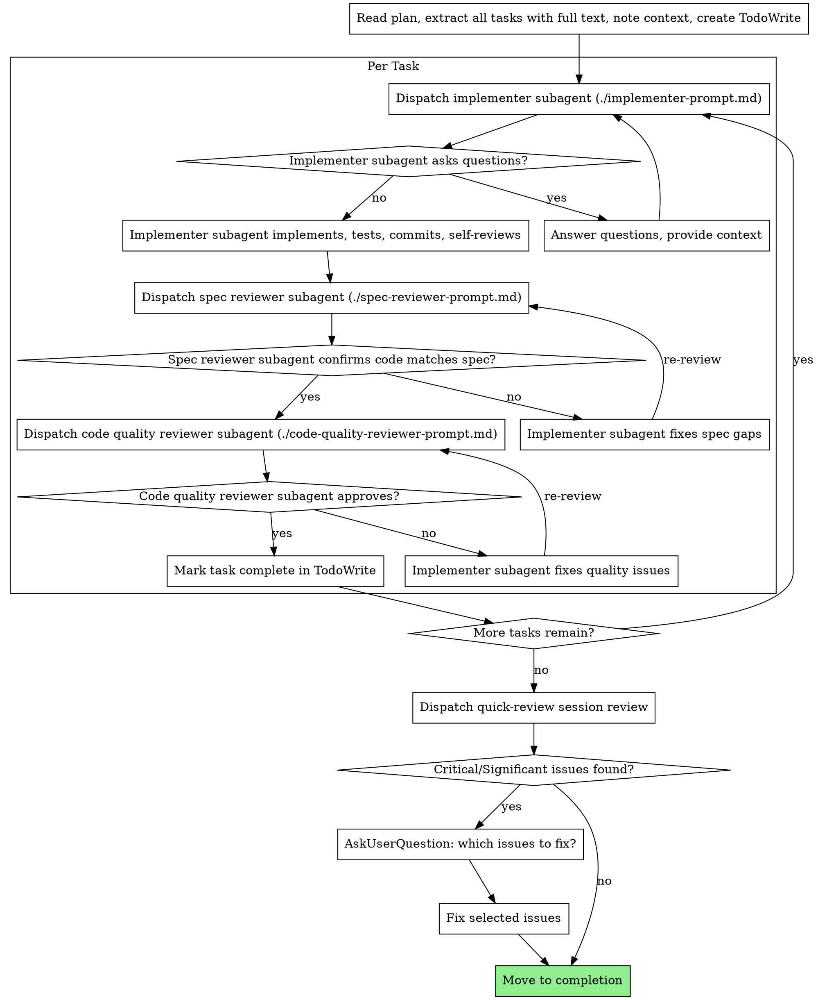

# Phase 6: Implement

Execute plan by dispatching fresh subagent per task, with two-stage review after each: spec compliance review first, then code quality review.

**Core principle:** Fresh subagent per task + two-stage review (spec then quality) = high quality, fast iteration

**Announce at start:** "Starting deep-work Phase 6: Implementation."

## Setup

1. Run `"$SKILL_BASE_DIR/setup.sh" "$ARGUMENTS"` and parse stdout for `REPO`, `TOPIC_SLUG`, `ARTIFACT_DIR`. `$SKILL_BASE_DIR` is the "Base directory for this skill" path shown at the top of this prompt.
   - If the script exits 2 (`MISSING_SLUG` on stderr), ask user via AskUserQuestion for the topic slug, then re-run with the slug.

## Pre-flight Validation

- `05-plan.md` exists → if not: "Plan not found. Complete Phases 1-5 first." **Stop.**

## Tooling

Use the agent's native task tools (in Claude Code: `TaskCreate`, `TaskUpdate`, `TaskList`). Manage task dependencies via `TaskUpdate`'s `dependency` field.

## Model Selection

All Task tool dispatches (implementer, spec reviewer, code quality reviewer, session quick-review) use `model: "sonnet"`.

## Plan Structure Expectations

The plan should be structured with clear headers for phases and tasks. The subagent-driven approach relies on dispatching a new subagent for as small a scope as possible to preserve context. Ideallly each task in a phase of the plan should be it's own subagent loop. Try to avoid sending whole phases or multiple tasks to a single subagent.

## The Process



## Prompt Templates

Subagent dispatches read their prompts from siblings in this directory: `./implementer-prompt.md`, `./spec-reviewer-prompt.md`, `./code-quality-reviewer-prompt.md`.

## Example Workflow

```
You: I'm using Subagent-Driven Development to execute this plan.

[Read plan file once: docs/plans/feature-plan.md]
[Extract all 5 tasks with full text and context]
[Create all tasks using the task tool]

Task 1: Hook installation script

[Get Task 1 text and context (already extracted)]
[Dispatch implementation subagent with full task text + context]

Implementer: "Got it. Implementing now..."
[Later] Implementer:
  - Implemented install-hook command
  - Added tests, 5/5 passing
  - Self-review: Found I missed --force flag, added it
  - Committed

[Dispatch spec compliance reviewer]
Spec reviewer: ✅ Spec compliant - all requirements met, nothing extra

[Get git SHAs, dispatch code quality reviewer]
Code reviewer: Strengths: Good test coverage, clean. Issues: None. Approved.

[Mark Task 1 complete]

Task 2: Recovery modes

[Get Task 2 text and context (already extracted)]
[Dispatch implementation subagent with full task text + context]

Implementer: [No questions, proceeds]
Implementer:
  - Added verify/repair modes
  - 8/8 tests passing
  - Self-review: All good
  - Committed

[Dispatch spec compliance reviewer]
Spec reviewer: ❌ Issues:
  - Missing: Progress reporting (spec says "report every 100 items")
  - Extra: Added --json flag (not requested)

[Implementer fixes issues]
Implementer: Removed --json flag, added progress reporting

[Spec reviewer reviews again]
Spec reviewer: ✅ Spec compliant now

[Dispatch code quality reviewer]
Code reviewer: Strengths: Solid. Issues (Important): Magic number (100)

[Implementer fixes]
Implementer: Extracted PROGRESS_INTERVAL constant

[Code reviewer reviews again]
Code reviewer: ✅ Approved

[Mark Task 2 complete]

...

[After all tasks]
[Dispatch quick-review session review: /quick-review local commits <git_sha_start>..<git_sha_end>]
Quick reviewer: Strengths: Solid architecture, good test coverage.
  Critical: SQL injection in search.ts:45
  Minor: Naming inconsistency in utils.ts

[Critical issues found → AskUserQuestion: "The session review found these Critical/Significant issues: ...
Which should be addressed?"]

User: "Fix the SQL injection, skip the naming issue"

[Fix SQL injection, re-commit]

Done!
```

## Session Review (After All Tasks)

After all tasks are complete, dispatch a fresh Task subagent (`general-purpose`, `model: "sonnet"`) to invoke the `/quick-review` skill:

```
Invoke the /quick-review skill to review the local commits <git_sha_start>..<git_sha_end>
```

When the review returns:
- **Critical or Significant issues found:** Use AskUserQuestion to present the findings and ask the user which parts of the implemented code should be changed. Apply requested fixes before proceeding to completion.
- **Minor issues only or no issues:** Proceed to completion.

This replaces the previous "final code reviewer" step with a fresh-context holistic review of all session changes.

## Red Flags

**Never:**
- Skip reviews — both spec compliance AND code quality, in that order. Reviewer issues block task completion until fixed and re-reviewed.
- Let implementer self-review replace actual review — both are needed.
- Dispatch multiple implementation subagents in parallel (commit conflicts).
- Make subagents read the plan file — provide the full task text plus only the relevant context, not the whole plan or unrelated details.
- Ignore subagent questions — answer them before letting work proceed.

**If a subagent asks questions:** answer clearly and provide additional context as needed before letting them proceed.

**If a reviewer finds issues:** the same implementer subagent fixes them and the reviewer re-reviews; repeat until approved.

**If a subagent fails a task:** dispatch a fix subagent with specific instructions rather than fixing manually (avoids context pollution).
