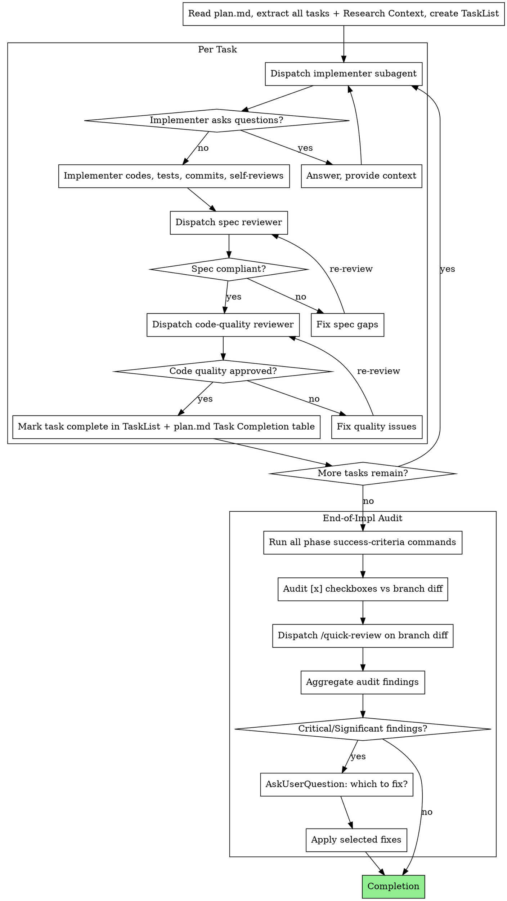

Execute a `/rpi-plan` plan by dispatching a fresh subagent per task with two-stage review after each, then running a baked-in audit pass at the end.

**RPI principle:** Research documents what **is**. Plan decides what **should change**. Implement performs the **change** and verifies it.

**Core principle:** Fresh subagent per task + two-stage review per task + end-of-impl audit = high quality, traceable execution.

**Announce at start:** "Starting /rpi-implement."

## Setup

1. Run `"$SKILL_BASE_DIR/setup.sh" "$ARGUMENTS"` and parse stdout for `REPO`, `TOPIC_SLUG`, `ARTIFACT_DIR`. `$SKILL_BASE_DIR` is the "Base directory for this skill" path shown at the top of this prompt.
   - If the script exits 2, `AskUserQuestion` for a slug.

## Pre-flight Validation

- `<ARTIFACT_DIR>/plan.md` exists → if not: "Plan not found at `<path>`. Run `/rpi-plan <slug>` first." **Stop.**
- Assume implementation happens on the current feature branch. Final audit/review should cover the branch's changes against its merge base with the parent branch.

## Tooling

Use the agent's native task tools (`TaskCreate`, `TaskUpdate`, `TaskList`). Track per-task dependencies via `TaskUpdate`'s `dependency` field.

## Model Selection

Use the following models for `Task` tool dispatches:
* implementer, spec reviewer:  `model: "sonnet"`
* code quality reviewer, session quick-review: `model: "opus"`.

## Plan Structure Expectations

When dispatching the implementer subagent, include the full task text **plus** the relevant excerpts from Research Context (typically `### Files in scope` and `### Patterns to follow`). Do NOT have subagents read the whole plan file.

## The Process

## Prompt Templates

Subagent dispatches read their prompts from siblings in this directory:
- `./implementer-prompt.md`
- `./spec-reviewer-prompt.md`
- `./code-quality-reviewer-prompt.md`

## Per-Task Execution

For each task in the plan, in order:

1. **Dispatch implementer subagent** (`./implementer-prompt.md`, `model: "sonnet"`). Pass: full task text + relevant excerpts from `## Research Context` (typically `### Files in scope` and `### Patterns to follow`).
2. **If implementer asks questions:** answer, then re-dispatch.
3. **Dispatch spec reviewer** (`./spec-reviewer-prompt.md`, `model: "sonnet"`). Pass: task requirements + implementer's report.
4. **If spec reviewer rejects:** fix the spec gaps; re-dispatch spec reviewer. Loop until approved.
5. **Dispatch code-quality reviewer** (`./code-quality-reviewer-prompt.md`, `model: "sonnet"`). Pass: implementer's report + the relevant task commit/diff range.
6. **If code-quality reviewer rejects:** fix the quality issues; re-dispatch code-quality reviewer. Loop until approved.
7. **Mark task complete:** update both `TaskUpdate` and the `Task Completion` table in `plan.md` (status `[x]`, fill the short SHA in `Committed`). If the implementer deviated from the plan, append an entry to the `Deviation Log` in `plan.md`.

## Resume

If invoked on a plan with some tasks already `[x]`:

1. Read the Task Completion table; collect IDs with status `[x]` (done) or `[-]` (skipped).
2. Skip those. Begin per-task execution at the first task with status `[ ]`, `[~]`, or `[!]`.
3. For `[~]` (in progress): check `git status`. If clean, restart the task. If dirty, `AskUserQuestion`: discard / proceed from dirty state.
4. For `[!]` (blocked): read the Deviation Log; `AskUserQuestion` whether the blocker is resolved before re-dispatching.
5. For resume, continue using the current feature branch as the unit of work; do not try to infer an implementation baseline from task commits.

## End-of-Implementation Audit

After all tasks are marked complete, read `./audit-checklist.md` and run that audit before declaring implementation done. Review the current feature branch's changes against its merge base with the parent branch.

## Completion

Report:
- Tasks completed (count) and Phase Progress / Task Completion tables fully filled.
- Audit summary: success criteria results, plan-vs-diff verdict, /quick-review verdict, any fixes applied.
- Branch/diff range reviewed for traceability.
- Plan file path: `<ARTIFACT_DIR>/plan.md`.

## Red Flags

**Never:**
- Skip the per-task spec compliance OR code quality review — both must pass before a task closes.
- Skip the end-of-impl audit because "the per-task reviews already caught everything" — the audit catches cross-task issues per-task reviews can't (regressions, scope creep, missed phase criteria).
- Dispatch multiple implementer subagents in parallel (commit conflicts).
- Make subagents read the full plan file — pass full task text + relevant Research Context excerpts only.
- Let implementer self-review replace external review — both are needed.

**If a subagent asks questions:** answer before letting them proceed.

**If a reviewer finds issues:** fix them and have the reviewer re-review; repeat until approved.

**If an audit finding requires a fix:** dispatch a fresh fix subagent rather than editing manually (avoids context pollution).

**If success criteria fail at audit time:** treat as Critical — fix before completion. A plan whose own success criteria don't pass after implementation is not done.
