# Phase 1: Research Questions

Decompose the user's prompt into objective, investigative questions answerable
by reading the codebase. Questions must NOT assume any particular solution.

**Announce at start:** "Starting deep-work Phase 1: Research Questions."

## Setup

1. Parse `$ARGUMENTS`:
   - If the first word is a valid slug (lowercase, hyphens, no spaces/special chars) and there is remaining text after it, use the first word as `<topic-slug>` and the rest as the task description
   - Otherwise, if a file path, read the file as the task description and extract or ask user for a `<topic-slug>`
   - Otherwise, use the full text as the task description and extract or ask user for a `<topic-slug>` (lowercase, hyphens, no special chars)
2. Run `"$SKILL_BASE_DIR/setup.sh" "<topic-slug>"` and parse stdout for `REPO` and `ARTIFACT_DIR` (script also creates the directory). `$SKILL_BASE_DIR` is the "Base directory for this skill" path shown at the top of this prompt.
3. Write `00-ticket.md` to the artifact directory:
   ```markdown
   ---
   phase: ticket
   date: <today>
   topic: <topic-slug>
   repo: <repo>
   git_sha: <HEAD>
   status: complete
   ---

   ## Ticket

   <user's prompt or file contents>
   ```

## Process

### Step 1: Distil the prompt or ticket
Identify the key nouns, systems, and actions mentioned in the prompt. These are the seeds for your research questions. Focus on concrete components, data flows, and interactions — avoid abstract goals or desired outcomes.
- Look for mentions of specific modules, APIs, data entities, user actions, or system behaviors.
- Look for in scope vs out of scope hints — what the user explicitly includes or excludes.
- Look for any stated constraints, requirements, or acceptance criteria.

### Step 2: Targeted codebase scan
Gather lightweight structural context (NOT deep implementation details):
- List root directory structure
- Read CLAUDE.md files for project context and conventions
- Dispatch a codebase-locator agent: "Find files and directories related to: <key nouns/systems from prompt>. Return locations grouped by purpose."

### Step 3: Generate research questions
Generate 5-20 questions. EVERY question must be:
- **Objective** — answerable by reading code, not by making design decisions
- **Specific** — references concrete subsystems, not abstract concepts
- **Grounded** — uses real module/file names from the codebase scan

Distribute across categories:

| Category | Pattern | Example |
|----------|---------|---------|
| Subsystem Understanding | "How does [component] work?" | "How does auth middleware chain requests?" |
| Code Tracing | "What is the [data] flow from [A] to [B]?" | "Request lifecycle from handler to DB?" |
| Pattern Discovery | "What patterns exist for [action]?" | "Patterns for adding API endpoints?" |
| Dependency Mapping | "What does [module] depend on?" | "What does handlers package import?" |
| Boundary Identification | "Where do [A] and [B] integrate?" | "Where do HTTP and storage connect?" |
| Constraint Discovery | "What invariants does [system] enforce?" | "What do tests enforce for handlers?" |

**FORBIDDEN question patterns:**
- "How should we..." — this is solutioning
- "What's the best way to..." — this is evaluation
- "Would it be better to..." — this is comparison
- "Can we..." — this is feasibility for a specific solution

### Step 4: Write artifact
Write `01-research-questions.md` to the artifact directory:
```yaml
---
phase: research-questions
date: <today>
topic: <topic-slug>
repo: <repo>
git_sha: <HEAD>
status: complete
---

## Original Prompt
<full prompt — stored for traceability, NOT passed to Phase 2>

## Research Questions

### Subsystem Understanding
1. <question>

### Code Tracing
2. <question>

### Pattern Discovery
3. <question>
...
```

## Handoff

```dot
digraph handoff {
    rankdir=LR;
    node [shape=box, style=rounded, fontname="Helvetica"];

    p1_out [label="01-research-questions.md\n(contains prompt + questions)"];
    user [label="User reviews &\nedits questions" shape=diamond style=filled fillcolor="#ffffcc"];
    script [label="extract-research-questions.sh\n(auto-run by Phase 2)" shape=octagon style=filled fillcolor="#ff4444" fontcolor=white];
    p2_in [label="Questions only\n(prompt never exposed)"];

    p1_out -> user [label="review & edit"];
    user -> script [label="fresh conversation\n/dw-02-research <slug>"];
    script -> p2_in [label="sed extraction"];
}
```



## Completion

1. Present questions to user grouped by category
2. Update `.state.json` in the artifact directory:
   ```json
   {
     "topic": "<topic-slug>",
     "repo": "<repo>",
     "current_phase": 1,
     "completed_phases": [1],
     "last_updated": "<ISO timestamp>"
   }
   ```
3. Instruct: "Review and edit questions in `01-research-questions.md` as needed.
   When ready, run `/dw-02-research <topic-slug>` in a **fresh conversation**.
   The research skill automatically extracts only the questions section via
   `extract-research-questions.sh` — the original prompt is never exposed to Phase 2."
